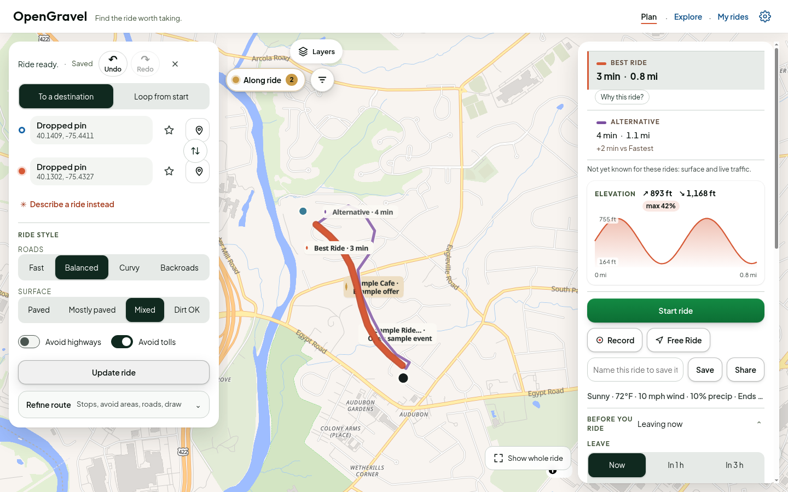
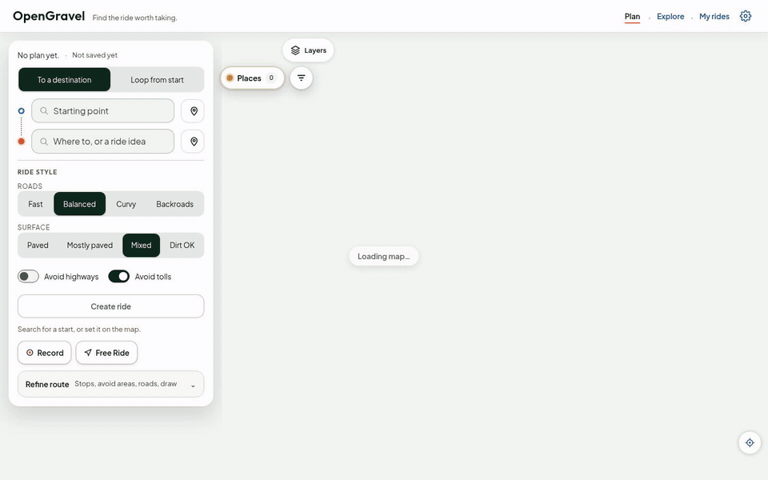
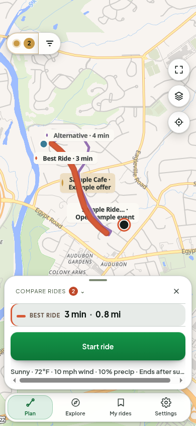

# OpenGravel

**Plan a ride around the roads you want to take.** OpenGravel is an open-source motorcycle route planner for shaping a trip, comparing route options, and taking your ride with you.

[](LICENSE)
[](https://github.com/OneBigHen/OpenGravel/actions/workflows/ci.yml)



<p align="center"><em>Plan a route, compare options, and see the shape of the ride.</em></p>

<p align="center">
  
</p>

<p align="center"><em>Choose two points and compare the sample route options.</em></p>

### On a phone

<p align="center">
  
</p>

Map attribution: [OpenFreeMap](https://openfreemap.org/) © [OpenMapTiles](https://www.openmaptiles.org/) Data from [OpenStreetMap contributors](https://www.openstreetmap.org/copyright). The offline map fixture used by tests has separate terms; see [THIRD-PARTY-NOTICES.md](THIRD-PARTY-NOTICES.md).

## What you can do

- Set a start and destination, add stops, or draw the shape you have in mind.
- Compare route choices by ride character, distance, and the evidence available.
- Save rides in your browser, import or export GPX, and continue into Ride Focus.
- Use your phone's location while riding. Downloaded maps and offline routing are available when you configure your own region data.
- Browse nearby places and route conditions when those services are configured.

Route and surface information can be incomplete. Check the route before riding; a sample or simulated route is never a riding recommendation.

## Quick start

You need Node.js 24 or later and npm. The demo runs without service credentials:

```sh
git clone https://github.com/OneBigHen/OpenGravel.git
cd OpenGravel
npm ci
npm run dev:demo
```

Open [http://localhost:3000](http://localhost:3000). Click the map to set two points, then choose **Create ride**. The demo uses fixture answers for routing, weather, place search, and a small sample catalog. It is for exploring the interface; it does not calculate live directions and must not be used for navigation. Map tiles still come from OpenFreeMap.

To run the app without fixtures, use `npm run dev`. Real route planning needs a GraphHopper server configured with the motorcycle profiles in [`infra/graphhopper/custom-models`](infra/graphhopper/custom-models). The app defaults to `http://127.0.0.1:8989`; set `GRAPHHOPPER_URL` and, if needed, `GRAPHHOPPER_API_KEY` in your private environment. For a public deployment, set `OGV_PUBLIC_ORIGIN` to its HTTPS URL so link previews resolve to your app. See [`.env.example`](.env.example) for optional settings.

## Data and privacy

Ride plans, saved rides, and recorded tracks are stored in browser storage by default. They are not sent to an OpenGravel account. Features that need outside data make requests to the service you configure or use: map tiles come from OpenFreeMap by default, place search uses Photon, weather comes from the National Weather Service, and route planning goes through your configured GraphHopper server. The optional advisor and places overlay also send the information needed for those requests to their configured services.

The geocoder has no built-in home-region bias. If you set `OGV_GEOCODER_BIAS`, that coordinate is sent as a search hint. A Mapbox public token, if used, is intentionally visible in the browser; never put a secret Mapbox token in a `NEXT_PUBLIC_` variable. Keep server API keys in an untracked `.env.local` or your hosting provider's secret store.

No third-party ride library is bundled in this repository. The demo catalog is synthetic and enabled only by `npm run dev:demo`.

## Development

```sh
npm run lint
npm run typecheck
npm test
npm run test:architecture
npm run build
npm run test:e2e:critical
```

The unit and architecture suites run without external services. The critical browser suite uses fixtures and a deterministic basemap. Live-router checks are optional and require a GraphHopper instance; set `GRAPHHOPPER_URL` before running `npm run test:real-router`.

Read [the architecture overview](docs/architecture.md) before changing application boundaries. Contributions and security reports are covered in [CONTRIBUTING.md](CONTRIBUTING.md) and [SECURITY.md](SECURITY.md).

## License and name

The source code is licensed under **GNU AGPL v3 only**; see [`LICENSE`](LICENSE). If you run a modified version as a network service, AGPL's source-offer terms apply.

The AGPL does not grant rights to the **OpenGravel** name, logo, or project branding. Forks should use a different name and must not imply that they are the official OpenGravel project.
