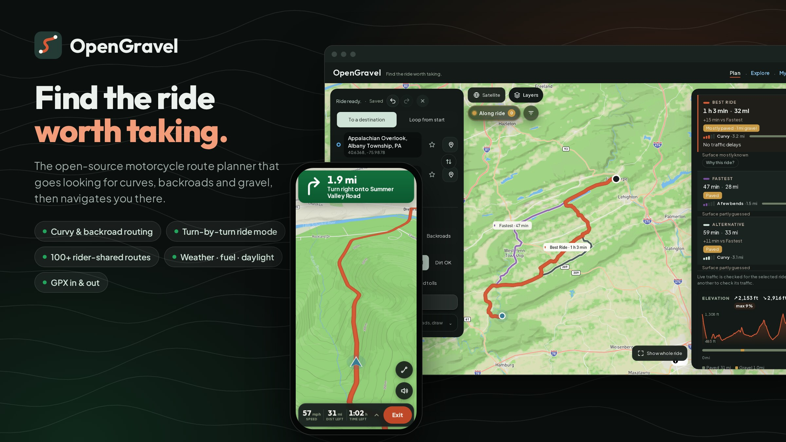
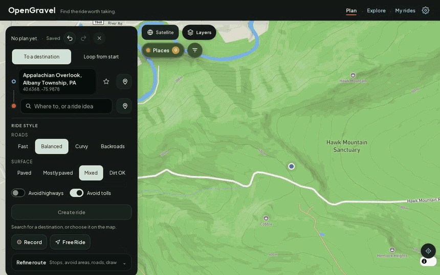
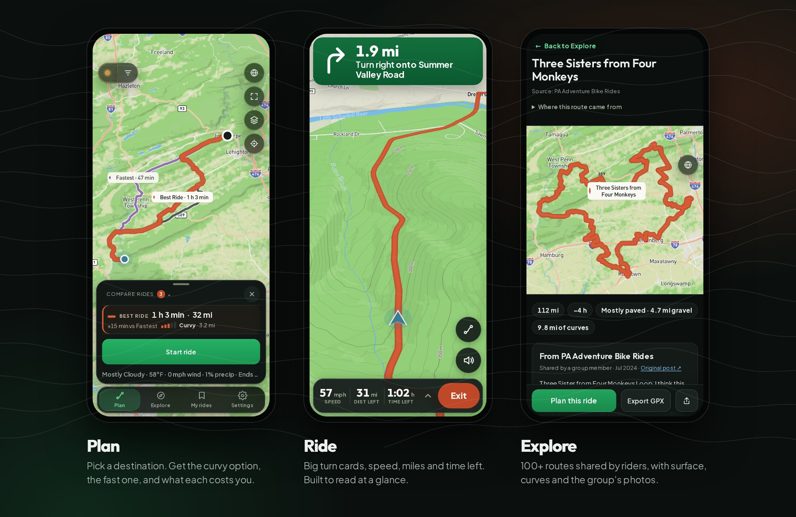
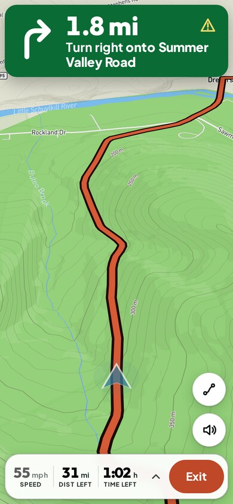
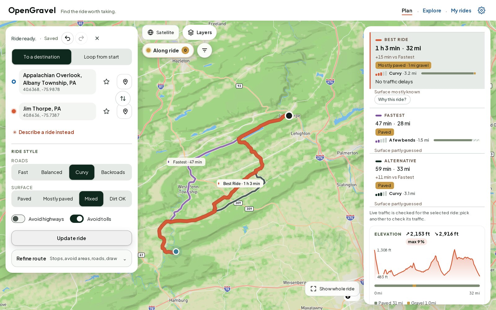
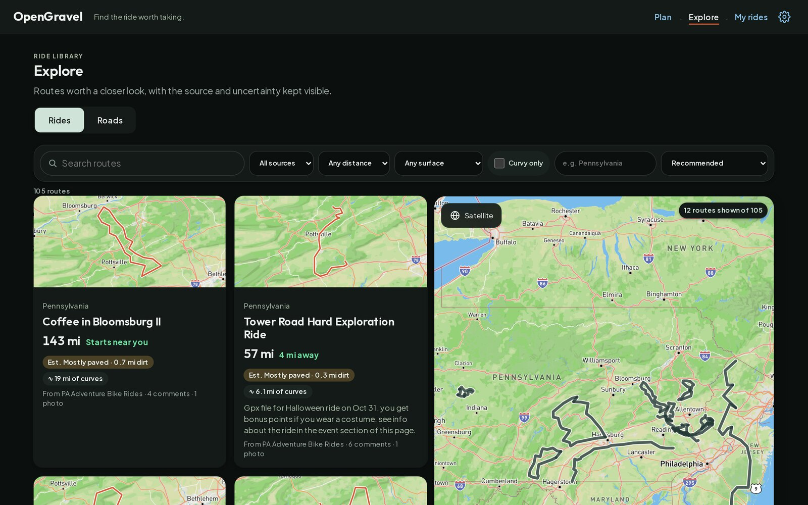
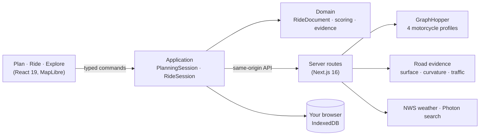

<p align="center">
  
</p>

<h1 align="center">OpenGravel</h1>

<p align="center">
  <strong>The open-source motorcycle route planner that goes looking for the good roads.</strong><br>
  Curvy tarmac, quiet backroads and gravel, compared honestly, then ridden turn by turn.
</p>

<p align="center">
  <a href="https://opengravel.henning.rodeo"></a>
  <a href="#run-it-yourself"></a>
</p>

<p align="center">
  <a href="LICENSE"></a>
  <a href="https://github.com/OneBigHen/OpenGravel/actions/workflows/ci.yml"></a>
  
  
  
  
  
</p>

---

Every map app can get you there fast. Riders want something else: the road that climbs the ridge, the gravel shortcut, the loop that ends back home in time for dinner. OpenGravel plans for that ride. It asks how you want to ride (fast, balanced, curvy or backroads; paved through dirt), finds several real options and shows what each one costs in minutes, curves and surface. Then it takes you there with big, sunlight-readable turn cards.

It is free, it runs in your browser, it needs no account, and you can host the whole thing yourself.

<p align="center">
  
  <br><sub>Real routing, no fixture: Hawk Mountain → Jim Thorpe, PA. The curvy ride takes 15 more minutes and gives you 3.2 curvy miles and a mile of gravel.</sub>
</p>

## What it does

<p align="center">
  
</p>

### 🗺️ Plan the ride you actually want
- **Ride style, not just "avoid highways".** Roads: *Fast · Balanced · Curvy · Backroads*. Surface: *Paved · Mostly paved · Mixed · Dirt OK*. Avoid highways and tolls.
- **Honest comparisons.** Every option shows time, miles, measured **curvy miles**, a **paved/gravel split** and live traffic. "Why this ride?" explains the pick, and anything the app doesn't know is labelled unknown.
- **Loops from home.** Say how long you want to ride (1–6 h) and get a round trip sized to fit.
- **Shape it by hand.** Add stops, block areas you want to skip, or **draw the route with your finger**. The line snaps to the roads you drew.
- **Describe it in words** (optional AI). *"Three hours of twisty backroads, lunch stop in Jim Thorpe, home before dark."* You review the proposal before anything changes.

### ⛅ Know before you go
- **Weather over the ride window** from the National Weather Service, for when you actually leave (now, in 1 h, tomorrow at 8 AM…).
- **Fuel range** checked against the route for the bike in your garage, less your reserve.
- **Daylight**: warns you if the ride ends after sunset.
- **Elevation profile** with climb, descent and the steepest grade.

### 🏍️ Ride it
- **Turn-by-turn Ride Focus**: a big turn card, speed, miles and time left, with the map taking most of the screen. There's a high-contrast **Day** theme for direct sunlight and a **Night** theme for dusk.
- **Voice prompts**, **re-center**, and **Head Home** from anywhere.
- **Free Ride**: no route, just ride. Get live speed, heading, moving time, max speed and elevation, with optional suggestions for roads worth a detour.
- **Record** your track and keep it in *My rides*.

<p align="center">
  
  &nbsp;&nbsp;
  
</p>

### 🧭 Explore 112 real rides
A built-in library of **112 routes across Pennsylvania and nearby states**, shared by riders in the [PA Adventure Bike Rides](https://www.facebook.com/groups/214850105910753/) community and the [Roost](https://roostlocker.com/) GPX locker. Each route comes with its **surface estimate**, **miles of curves**, how far away it starts, the group's **photos and trail notes**, and a link to the original post. Filter by distance, surface or *curvy only*, then tap **Plan this ride** or **Export GPX**.

<p align="center">
  
</p>

### 🔒 Yours, not ours
- **No account and no tracking by default.** Rides, bikes and recordings live in your browser (IndexedDB). Telemetry is off until you opt in.
- **GPX in, GPX out.** Import from Garmin, Calimoto, Kurviger, REVER or any other app, and export to your GPS.
- **Share a link** with a rich preview, and a privacy preview before anything leaves your device.
- **Installable** on iPhone, Android and desktop as a PWA. There's also a native **iOS shell** with [Ferrostar](https://github.com/stadiamaps/ferrostar) navigation in [`apps/ios`](apps/ios).
- **Offline maps and offline routing** when you build a region pack ([`infra/maps`](infra/maps)).

## Why another route app?

Calimoto, Kurviger and REVER are good apps. They are also closed, account-bound and increasingly paywalled, and your ride history lives on their servers. OpenGravel is the open alternative:

- **Free.** No "Premium" tier, no ride limits.
- **No account.** Your rides stay on your device unless you share them.
- **Open source** under AGPL-3.0. Read it, fork it, fix it.
- **Self-hostable**, and every provider (routing, tiles, search, weather) is swappable.
- **Honest.** Estimates are labelled as estimates, and unknown is shown as unknown, never as a guess.

## Run it yourself

You need **Node.js 24+**.

```sh
git clone https://github.com/OneBigHen/OpenGravel.git
cd OpenGravel
npm ci
npm run dev:demo      # no keys, no routing server: open http://localhost:3000
```

`dev:demo` loads the real route library in **Explore**. Planning, weather and search use labelled sample answers, so you can try every screen offline. Don't navigate with the demo routes.

**Real routing** needs a [GraphHopper](https://github.com/graphhopper/graphhopper) server with the four motorcycle profiles in [`infra/graphhopper/custom-models`](infra/graphhopper/custom-models) (`motorcycle_fastest`, `_twisty`, `_scenic`, `_adventure`):

```sh
cp .env.example .env.local   # set GRAPHHOPPER_URL (default http://127.0.0.1:8989)
npm run dev
```

Everything else is optional and set in `.env.local`: a Mapbox public token for terrain and satellite (OpenFreeMap is the free default), a self-hosted Photon geocoder, a places feed, and an OpenAI-compatible endpoint for "Describe a ride". See [`.env.example`](.env.example).

Optional browser/PWA Spotify controls use PKCE and never stream audio in the browser. See the [Spotify setup guide](docs/spotify.md) for the private session key, callback allowlist and rider-owned app setup.

## How it works



- The **domain** is framework-free: ride documents, route scoring, curvature from real bend geometry, surface evidence.
- The **map never decides anything.** Map clicks become typed intents, and the application layer applies them as undoable commands.
- **Credentials stay on the server.** The browser only talks to its own origin.
- **Architecture tests** enforce those boundaries in CI, next to about 3,000 unit and integration tests and a Playwright browser suite.

Read [`docs/architecture.md`](docs/architecture.md) before changing boundaries.

```sh
npm run lint && npm run typecheck && npm test && npm run build   # or: npm run verify
npm run test:e2e:critical                                        # Playwright, after a build
```

## Roadmap

- [ ] Routing across the whole continental US (the hosted demo covers PA and nearby states)
- [ ] Fun-road scoring out of shadow mode: elevation, traffic and junction density feeding the pick
- [ ] Native iOS navigation on device, then CarPlay
- [ ] Community route submissions with moderation
- [ ] More route libraries. Got a club GPX collection? [Open an issue](https://github.com/OneBigHen/OpenGravel/issues).

## Contributing

Riders and developers are both welcome. Bug reports from real rides are gold. Start with [CONTRIBUTING.md](CONTRIBUTING.md); security reports go to [SECURITY.md](SECURITY.md).

## Credits

- **Routes and photos**: members of [PA Adventure Bike Rides](https://www.facebook.com/groups/214850105910753/) and [Roost](https://roostlocker.com/). Rider names are removed; every route links back to its original post. If you shared a route and want it credited differently or removed, [open an issue](https://github.com/OneBigHen/OpenGravel/issues). See [THIRD-PARTY-NOTICES.md](THIRD-PARTY-NOTICES.md).
- **Map data** © [OpenStreetMap](https://www.openstreetmap.org/copyright) contributors. Tiles from [OpenFreeMap](https://openfreemap.org/) / [OpenMapTiles](https://www.openmaptiles.org/).
- **Routing** by [GraphHopper](https://github.com/graphhopper/graphhopper), **search** by [Photon](https://github.com/komoot/photon), **weather** by the [National Weather Service](https://www.weather.gov/documentation/services-web-api), **rendering** by [MapLibre GL JS](https://maplibre.org/), **native navigation** by [Ferrostar](https://github.com/stadiamaps/ferrostar).

## License

Code: **GNU AGPL-3.0-only**; see [LICENSE](LICENSE). If you run a modified version as a public service, share your changes. The route library and photos belong to the riders who shared them and are **not** covered by the AGPL (see [THIRD-PARTY-NOTICES.md](THIRD-PARTY-NOTICES.md)). The OpenGravel name and logo aren't licensed for forks, so please pick your own name.

<p align="center"><sub>Built in Pennsylvania by riders, for riders. Check the road before you trust it. 🏍️</sub></p>
