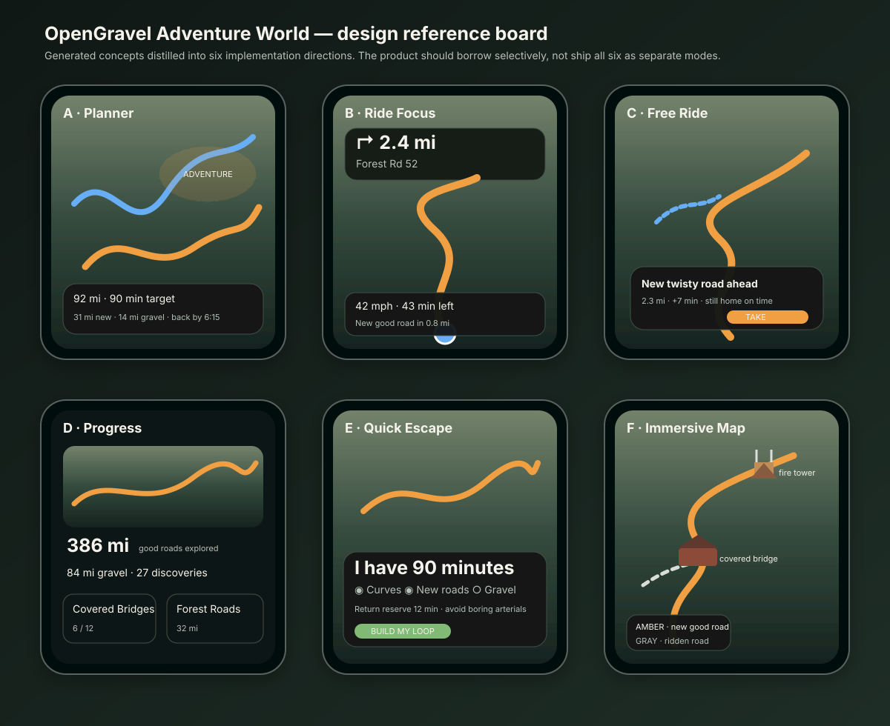

# OpenGravel Adventure World

Status: product/architecture work order  
Target: OpenGravel mainline after map-layer foundation  
Working branch: `feat/gaia-goat-layer-parity`  
Core rule: **Ride first. World second. Game third.**



## Hard reset after design review

The first Adventure draft drifted too far toward spatial demos, AR, Niantic, splats, and destination "3D postcards."

That is not the product.

The compelling product is much simpler:

> **I have 60–120 minutes. Give me a ride worth taking, get me home when I said I would be home, and keep making my local map more interesting the more I ride.**

For the default experience:

- no Niantic dependency
- no paid spatial API
- no AR requirement
- no separate 3D viewer
- no Unity dependency
- no cloud account requirement
- no requirement to stop at a POI
- no requirement to touch the screen while moving

The visual ambition stays. The expensive architecture does not.

## Target rider

The main design target is not an all-day ADV expedition.

It is a rider who:

- has a bike already in the garage
- has 45, 60, 90, or 120 minutes
- may be leaving from a suburban area
- knows the obvious local roads already
- wants a reason to take the bike out
- wants curves, backroads, occasional gravel, scenery, or simply somewhere new
- needs to be home at a predictable time
- does not want 10 minutes of route planning
- will mostly glance at a mounted phone and listen to prompts

If this rider cannot get a useful loop from app-open to ignition in roughly 20 seconds, Adventure is too complicated.

## Product promise

**Give OpenGravel a time budget, not a destination.**

Primary entry:

```text
How much time do you have?

[ 45 min ] [ 60 min ] [ 90 min ] [ 2 hr ]

or

Back by [ 6:15 PM ]
```

Then one flavor:

```text
What sounds good?

[ Curves ] [ New roads ] [ Gravel ] [ Scenic ] [ Surprise me ]
```

Optional details stay behind one secondary control.

The default action is:

> **Build my loop**

Not "create expedition", "start quest", or "select collection."

## The 20-second loop

1. Open OpenGravel.
2. Tap `90 min`.
3. Tap `Curves` or leave the remembered preference.
4. OpenGravel produces three loops.
5. Pick one.
6. Ride.
7. OpenGravel quietly records new worthwhile roads.
8. After the ride, show what changed on the rider's map.

The game exists mostly before and after the ride.

During the ride, it is navigation.

## Time budget is a hard constraint

A short-session rider cares more about getting home on time than squeezing in one more discovery.

Define:

```ts
interface RideTimeBudget {
  hardBudgetMinutes: number;
  reserveMinutes: number;
  targetRideMinutes: number;
  backBy?: string;
}
```

Initial policy:

```text
reserveMinutes = max(8 minutes, 10% of hard budget)
targetRideMinutes = hard budget - reserve
```

Examples:

- 45-minute request → target about 37 minutes
- 60-minute request → target about 52 minutes
- 90-minute request → target about 81 minutes
- 120-minute request → target about 108 minutes

This is deliberately conservative.

The UI can expose the unused margin:

> **Home 6:03 PM · 12 min buffer**

If live traffic or rerouting eats the buffer, Adventure suggestions stop.

### Back-by confidence

Eventually calculate a bounded return confidence from:

- live traffic where available
- route class
- known construction/closure evidence
- urban intersection density
- expected lower speeds on gravel
- time-of-day variance
- weather context

Do not pretend an ETA is exact.

The useful statement is:

> **Expected home 6:03 · planned buffer 12 min**

not:

> **Home 6:03 guaranteed**

## Do not gamify every road

This is the most important product correction.

A rider should not feel compelled to clear every cul-de-sac and residential grid.

Only **explorable roads** count toward the Adventure map.

Suggested eligibility:

```text
road is legal/allowed
AND routeable for the current motorcycle profile
AND length >= useful minimum
AND NOT ordinary service/parking road
AND (
  curvature >= threshold
  OR gravel/surface interest
  OR elevation/terrain interest
  OR scenic/public-land context
  OR low-traffic backroad character
  OR belongs to a known riding corridor
  OR acts as a necessary connector between good segments
)
```

Residential roads can still route normally. They simply do not become collectibles.

This keeps the explored map meaningful.

## Roads are the progression system

For an explorable road segment, store local-first progress:

```ts
interface RoadProgress {
  segmentId: string;
  firstRiddenAt: string;
  lastRiddenAt: string;
  rides: number;
  directions: readonly ("forward" | "reverse")[];
  surfaceObserved?: string;
}
```

Rider-facing states:

- **not ridden** — normal cartography
- **ridden** — subtle cool/slate trace in planning/explore views
- **new this ride** — temporary warm trace
- **favorite** — explicit rider mark
- **needs verification** — optional post-ride field note

No XP is necessary.

The reward is watching a map of good roads become yours.

## Novelty must never overpower fun

A naive unexplored-road algorithm will route riders onto mediocre roads simply because they are new.

Novelty is a capped ingredient.

First-pass route utility:

```text
route utility =
    0.28 road fun / curvature
  + 0.18 novelty
  + 0.14 continuity / flow
  + 0.12 surface match
  + 0.10 scenic / terrain context
  + 0.08 low urban friction
  + 0.05 useful discoveries
  + 0.05 return-time confidence
  - major-road penalty
  - stoplight/junction penalty
  - access uncertainty penalty
  - excessive out-and-back penalty
  - boring connector penalty
```

Novelty should saturate.

A route that is 30% new and excellent should usually beat a route that is 80% new and mediocre.

## Escape the suburb quickly

For a rider starting near Philadelphia suburbs, the first problem is often not "find a mountain." It is "stop wasting my limited ride time on traffic lights."

Create an **escape cost** for the first and final legs.

Penalize:

- dense traffic signals
- high junction density
- multilane commercial arterials
- repeated stop signs
- unnecessary urban zig-zags
- school/retail corridors when good alternatives exist

Allow unavoidable boring distance, but minimize it.

The route explanation can say:

> **11 min to the good roads · 54 min backroads · 13 min home**

That is more useful than a generic "scenic score 87."

## Three candidate loops, not twenty

For a short-session request, generate only three meaningfully different answers.

Example for 90 minutes:

### More curves
- 78 min planned
- 32 curvy miles
- 11 mi new
- paved

### More new roads
- 80 min planned
- 24 curvy miles
- 23 mi new
- 3 mi gravel

### More dirt
- 76 min planned
- 18 curvy miles
- 14 mi new
- 16 mi gravel

The user should be able to pick from that screen without opening route details.

## Free Ride: "one more road" only when it actually fits

Free Ride should know the rider's time constraint.

A dynamic offer can appear only if accepting it still preserves the return buffer.

Good:

```text
NEW TWISTY ROAD
2.3 mi ahead
+7 min
Still home by 6:10

[ TAKE ]
```

Bad:

```text
RARE DISCOVERY!
Detour now!
```

If the reserve is gone, the copilot becomes quiet except for navigation/safety information.

## Discoveries support the ride; they are not the game

World Nodes remain useful, but subordinate.

Good nodes:

- covered bridge
- fire tower
- overlook
- waterfall visible from/near road
- historic road structure
- ferry
- unusual roadside object
- useful rider stop
- forest entrance
- dam / reservoir overlook

A node can improve a route and make the map richer.

It should not force a check-in.

Passing it can mark it discovered automatically.

Collections remain optional background motivation:

- Covered Bridges
- Fire Towers
- River Crossings
- State Forests
- Scenic Overlooks
- Historic Roads

No daily streaks. No energy. No coins. No public speed ranking.

## Map-integrated 3D, not 3D postcards

The generated concepts exposed the right visual direction: **small 3D objects should live directly in the map**.

A rider looking at a pitched map should be able to recognize:

- a covered bridge standing over the stream
- a fire tower on the ridge
- a dam across a reservoir
- a water tower
- a tunnel portal
- a ferry crossing
- a prominent lookout structure

These are map landmarks, not separate experiences.

### Free/open implementation

Use reusable low-poly archetypes rather than scanned photoreal landmarks.

Potential asset types:

```text
covered_bridge.glb
fire_tower.glb
lookout.glb
dam.glb
water_tower.glb
tunnel_portal.glb
ferry.glb
wind_turbine.glb
camp.glb
historic_mill.glb
```

One model can be instanced hundreds of times.

Source placement/orientation from OSM/Wikidata/OpenGravel data.

This gives the "tiny real world" feeling from the concepts for almost no network cost.

### Web renderer

MapLibre GL JS supports 3D custom layers; its official examples show georeferenced glTF models rendered through Three.js.

Implementation experiment:

```text
MapLibre GL JS
  + terrain
  + custom 3D layer
  + Three.js
  + GLB archetype pack
```

This is optional enhancement. A plain symbol always exists as fallback.

### Native iOS renderer

MapLibre Native's iOS Metal backend is production-supported and exposes custom Metal style layers.

Use that path for a future native landmark layer rather than embedding Unity.

### LOD policy

Do not render a miniature city.

Example:

- regional zoom: no 3D landmarks
- planning zoom: only iconic/high-score landmarks
- close planning: selected and nearby landmarks
- riding speed: at most a tiny number ahead/on-route
- maneuver-heavy state: suppress decorative models

Target an instance budget, not an object-count free-for-all.

## Adventure Vision should be subtle

Adventure Vision answers:

> **Where are the roads I am likely to enjoy?**

It can combine:

- Great Roads curvature
- gravel evidence
- terrain relief
- public-land/forest context
- low junction density
- scenic nodes
- roads not yet ridden

At low zoom it is a soft field.

At higher zoom it resolves to actual road segments.

Never show a giant heatmap during active navigation.

## Progress screen: keep only what motivates another ride

Useful:

- worthwhile road miles explored
- gravel miles explored
- new roads this month
- a map showing where the rider has expanded
- collections that are naturally geographic
- favorite roads
- "areas you haven't ridden yet"

Questionable:

- generic level
- XP total
- badges for app usage
- ride streak
- arbitrary region percentage
- leaderboard

The best call to action from Progress is:

> **Find me 60 minutes of new roads**

## Post-ride payoff

The ride summary should answer "was that worth leaving the house for?"

Example:

```text
87 minutes
61 miles

18.4 mi new good roads
6.2 mi new gravel
1 new favorite corridor

2 discoveries
Covered bridge
Reservoir overlook

Your explored map expanded northwest.
```

Then animate only the newly ridden worthwhile segments onto the map.

Offer field verification after the bike is stopped:

- Still gravel?
- Gate open?
- Road paved now?
- Construction?
- Surface rougher than mapped?

## PA pilot

Pennsylvania is a good stress test because the product has to work in both suburban short-loop riding and serious state-forest riding.

### Pilot A — Southeast PA short sessions

Goal:

> prove a 60–120 minute loop can feel worthwhile from a suburban start.

Stress:

- urban escape cost
- traffic signals
- short backroad fragments
- Delaware River / Upper Bucks scenery
- covered bridges / historic structures
- limited gravel compared with central PA
- hard return-time constraint

This is the product test that prevents Adventure from becoming useful only to someone already parked next to a national forest.

### Pilot B — Bald Eagle / central PA dual-sport

Use official access data as a truth source.

DCNR states that roads and drivable trails shown on the Bald Eagle State Forest Public Use Map are open to licensed motorcycles year-round, while some purple-marked trails/gated roads have seasonal conditions.

This is exactly why Adventure must separate:

- fun
- surface
- legal access
- seasonal access
- rider progress

Do not derive access from "someone rode here before."

### PA seed layers

Useful official context:

- PennDOT PA Byways program
- DCNR public-use maps
- DCNR forest advisories/access
- existing OpenGravel USFS MVUM authority where applicable
- PennDOT traffic/closure/camera work already in OpenGravel
- NWS weather
- USGS 3DEP terrain

PennDOT currently lists 21 designated PA Byways, one Forestry Byway, and four National Scenic Byways. They are not automatically "best motorcycle roads", but they are useful seed corridors and scenic evidence.

## Free-first stack

P0 must work with free/open sources:

```text
MapLibre GL JS / MapLibre Native
OpenStreetMap / OpenFreeMap / self-hosted vector tiles
OpenGravel PMTiles
USGS 3DEP
Wikidata / Wikipedia / Wikimedia
PAD-US
NWS
public state/federal GIS
OpenGravel-derived road evidence
local IndexedDB / native storage
```

Optional providers may improve quality, but no Adventure feature may require a paid provider to function.

Niantic is out of the core plan.

Unity is out of the core plan.

A future R&D branch can revisit either if they solve a concrete problem better than the free stack.

## Design reference: what to keep from the six screens

### A — Adventure Vision planner

Keep:
- topographic depth
- route vs unexplored-road distinction
- simple summary of new roads/gravel
- Adventure zones as a planning hint

Reject:
- too many glowing layers simultaneously
- route line competing with heatmap

### B — Ride Focus

Keep:
- large maneuver
- terrain visible ahead
- one "new road" metric
- one upcoming discovery

Reject:
- four continuously changing metrics if they reduce glanceability
- big discovery photo while moving

### C — Free Ride copilot

Keep:
- one high-value suggestion
- visible `+ minutes`
- "still home on time"

Reject:
- full-width promotional card while at speed
- multiple map callouts

### D — Progress

Keep:
- map as hero
- road history
- a few geographic collections

Reject:
- gamification becoming the home screen
- fake completion percentages for arbitrary areas

### E — Quick Escape builder

This is the strongest product direction.

Keep:
- time first
- new roads / gravel / scenic as simple objectives
- back-by constraint
- immediate generated loop

Change:
- "Find 3 new roads" to a softer novelty preference
- avoid exact collectible counts as the primary planning input

### F — Immersive map

Keep:
- terrain diorama feeling
- integrated miniature landmarks
- explored/new road styling
- minimal chrome

Reject:
- photo-real scenery as a requirement
- decorative 3D if it hurts frame rate/readability

## Proposed home action

A single persistent action should expose the whole feature:

```text
QUICK RIDE

I have [ 90 min ▾ ]

Mood
[ Curves ] [ New ] [ Gravel ] [ Scenic ]

[ BUILD MY LOOP ]
```

Remember the rider's usual choices.

A repeat user can be riding in three taps.

## Architecture

Do not scatter game checks throughout the UI.

```text
src/application/world/
  types.ts
  explorable-road.ts
  progress.ts
  novelty.ts
  collections.ts
  scene.ts

src/application/quick-ride/
  time-budget.ts
  candidate-score.ts
  escape-cost.ts
  build-loop.ts
  explain.ts

src/infrastructure/world/
  rider-world-repository.ts
  compiled-world-source.ts

src/infrastructure/map/maplibre/
  adventure-scene.ts
  landmark-model-layer.ts   // web experiment
```

Persist progress locally.

Provider/source data remains separate from rider progress.

## P0 build slice

Do not start with 3D.

Ship the fun loop first.

1. Define `ExplorableRoad`.
2. Record ridden explorable segments from ride traces.
3. Add 45/60/90/120-minute Quick Ride entry.
4. Add novelty as a capped route-scoring term.
5. Add urban escape cost.
6. Produce exactly three candidate loops.
7. Show new-road miles before ride.
8. Show new-road miles after ride.
9. Add Free Ride offer budget guard.
10. Test in Southeast PA with 60/90/120-minute sessions.

Acceptance:

> Someone can leave home for 90 minutes, get a route in seconds, ride mostly worthwhile roads, discover some roads they have not ridden, and return with the planned buffer still intact.

## P1 visual slice

After P0 is fun without 3D:

1. explored-road map treatment
2. Adventure Vision low-zoom field
3. stronger terrain styling
4. route ribbon polish
5. 5–10 reusable GLB landmark archetypes
6. web Three.js custom-layer proof
7. native Metal landmark-layer proof
8. strict LOD / thermal / FPS budgets

The 3D layer has to earn its battery cost.

## P2 PA data quality

1. authority-aware state-forest/public-use roads
2. seasonal access
3. PennDOT/511 incidents and closures
4. road surface confidence
5. signal/junction-density escape cost
6. field verification
7. regional offline compilation

## Explicitly out of scope for core Adventure

- Niantic
- Gaussian splat pipeline
- AR
- Pokémon GO data
- Unity navigation
- speed leaderboards
- ride streaks
- loot/coins/XP
- tapping to collect while moving
- "complete every road"
- social live location
- cloud-required progression

## Product test

Every proposed feature has to pass this question:

> **Would this make a rider more likely to use a spare 60–120 minutes to go ride?**

If the answer is "it makes the app more impressive" rather than "it makes the ride easier to start or more fun to take," cut it.
